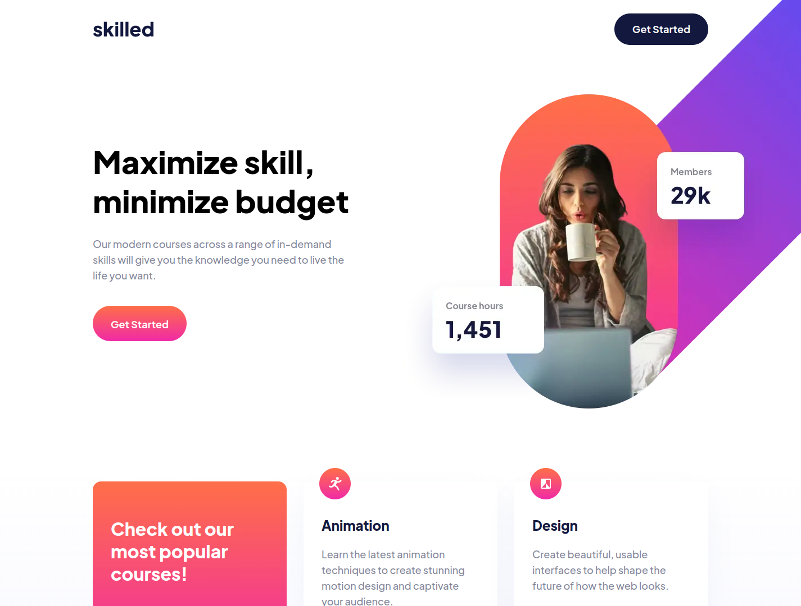

# Frontend Mentor | Skilled e-learning landing page
This is my solution to the [Skilled e-learning landing page challenge](https://www.frontendmentor.io/challenges/skilled-elearning-landing-page-S1ObDrZ8q) from [Frontend Mentor](https://www.frontendmentor.io/).

## Tech Stack
 - Angular
 - SCSS

## Developer Tools
 - VS Code
 - Figma

## Links
 - [Live version](https://fem-skilled-e-learning-lp-jgerard.pages.dev) hosted with [Cloudflare Pages](https://pages.cloudflare.com/)
 - [Solution](https://www.frontendmentor.io/solutions/angular-with-scss-8jIGfw_7Wm)

## Screenshots
### Mobile

### Tablet

### Desktop

## About Frontend Mentor
[Frontend Mentor](https://www.frontendmentor.io/) challenges help you improve your coding skills by building realistic projects.

## Copyright
© 2023 Johnny Gérard
